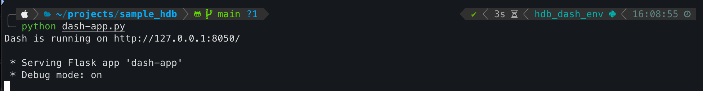

# 🏘️ HDB Resale Flats Recommendation for Young Families

This Dash web app helps young families in Singapore find suitable HDB resale flats by balancing key priorities like proximity to schools, transportation, and amenities. It provides interactive filters, scoring logic, map visualizations, and price analytics—all in one platform.<br><br>

Credits to Beatrice, Jennifer and Ziming for all their inputs for brainstorming of ideas and coming up with this collectively during coaching sessions just that we did not have enough time to put everything together cleanly.<br><br>

and of course chatgpt, also copilot when chatgpt limit was reached.

---

## 🚀 Features

- 🎯 Location Prioritization: Select desired towns, nearby primary schools (with affiliations), and transportation options.
- 💸 Budget Filtering: Use a slider to set your resale price range.
- 🏠 Flat Type & Age Selection: Filter by flat type and maximum age.
- 🧮 Scoring: Computes weighted scores based on your preferences.
- 📊 Insights: Includes correlation heatmaps and price trend timelines.
- 🗺️ Map: View recommended flats and nearby amenities interactively.
- 📥 CSV Export: Download your selected flat recommendations.

---

## 📂 Data Description

The app uses a CSV dataset located at:

```
datasets/train.csv
```

This dataset includes fields like:
- `resale_price`: Sale price (SGD)
- `flat_type`, `flat_model`, `floor_area_sqm`, `hdb_age`
- `Latitude`, `Longitude`, `town`, `planning_area`
- Nearby amenities like MRT, malls, hawker centres, schools
- Affiliation, distances, and unit details

For full data column descriptions, refer to data_dictionary.md

---

## ⚙️ Setup Instructions

### Prerequisites

Make sure you have Python 3.8+ installed.

### Install Required Packages

```bash
pip install -r requirements.txt
```

Here’s the contents of `requirements.txt`:

```
dash>=2.11.0
plotly>=5.19.0
pandas>=2.2.2
numpy>=1.26.4
```

### Run the App

```bash
python dash-app.py
```
you should see this in your terminal<br>


Fyi, there are still a few errors but able to run<nr><nr>
/Users/chngshuyan/projects/sample_hdb/dash-app.py:689: UserWarning:<br>
DataFrame columns are not unique, some columns will be omitted.<br>
/Users/chngshuyan/projects/sample_hdb/dash-app.py:738: DeprecationWarning:<br>
*scattermapbox* is deprecated! Use *scattermap* instead. Learn more at: https://plotly.com/python/mapbox-to-maplibre/<br>


Visit `http://127.0.0.1:8050` in your browser to use the app.

> 📸 Optional: You can place a header image in `assets/singapore_hdb.jpg` to display on the app's banner.

---

## 🛠 Project Structure

```
├── assets/
│   └── singapore_hdb.jpg    # Optional header image
├── datasets/
│   └── sample_sub_reg.csv   # Data source
│   └── test.csv             # Data source
│   └── train.csv            # Data source
├── dash-app.py              # Main Dash application
├── data_dictionary.md       # From sample_hdb dataset
├── environment.yml          # environment
├── README.md
└── requirements.txt
```

---


